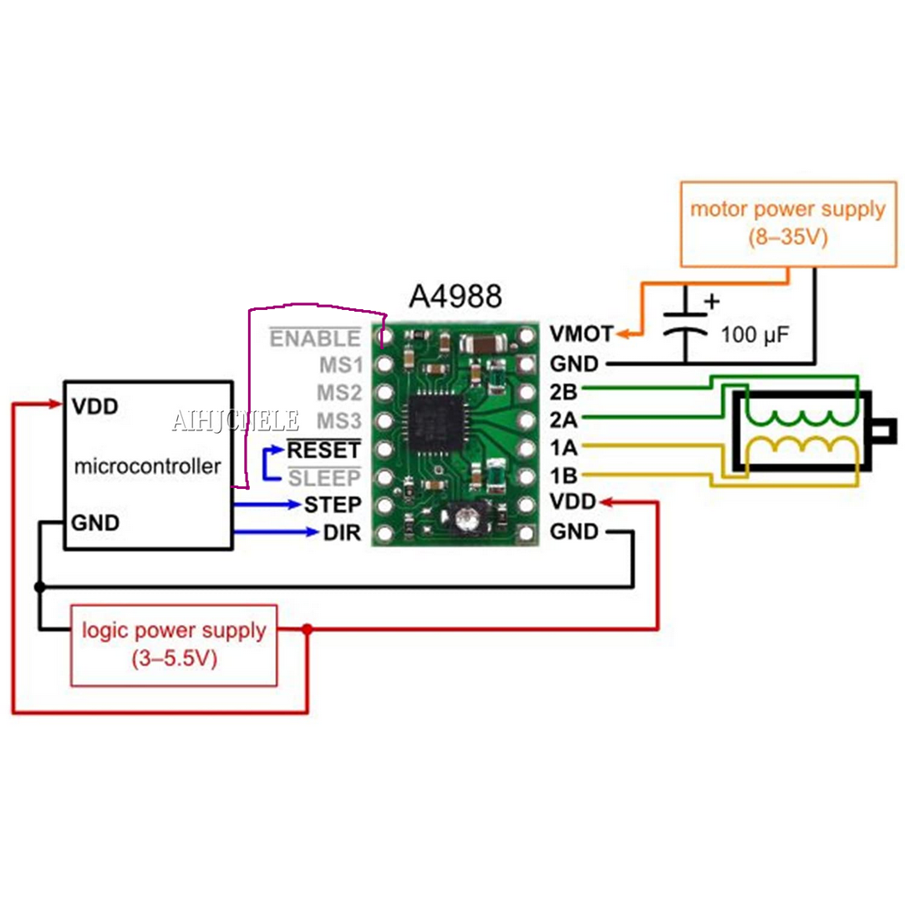

# HR4988-test-code
Simple test code for the HR4988. made this since all the examples i found made me think somethings broken, this one spins CW and CCW, taking turns (get it, turns ;>)
## Schematic

